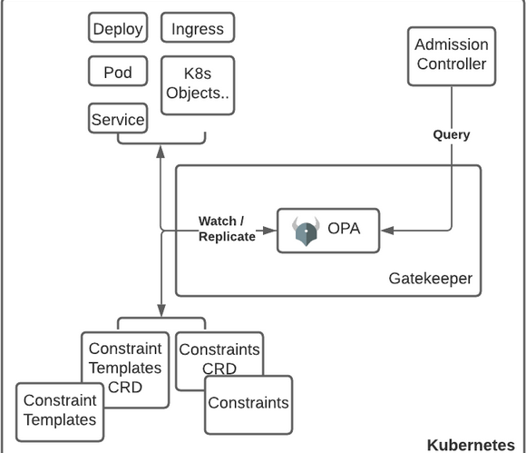

# kubernetes gatekeeper

Gatekeeper is an admission controller that validates requests to create and update Pods on Kubernetes clusters, using the Open Policy Agent (OPA). Using Gatekeeper allows administrators to define policies with a constraint, which is a set of conditions that permit or deny deployment behaviors in Kubernetes.

OPA Gatekeeper with Kubernetes creating policies to manage Kubernetes like.

-   Enforcing labels on namespaces.
-   Allowing only images coming from certain Docker Registries.
-   Require all Pods specify resource requests and limits.
-   Prevent conflicting Ingress objects from being created.
-   Enforcing running containers as non-root.
